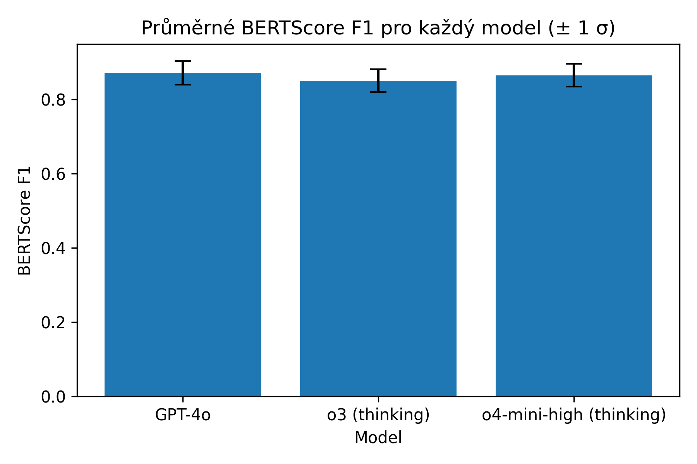

# Automatizovaná generace docstringů pro Python pomocí LLM

Krátký přehled projektu a výsledků experimentu s generováním dokumentace (docstringů) pro existující Python kód s pomocí velkých jazykových modelů (LLM).

## Popis práce
Cílem studie je ověřit, jak efektivně dokážou moderní LLM (GPT-4o, o4-mini-high, o3) automaticky generovat docstringy pro 15 funkcí a metod z různých Python repozitářů. Původní docstringy byly z kódu odstraněny („code_no_doc“) a modelům předkládány v samostatných chatech s jednoduchým promptem:
````
```
<code_no_doc>
```

Add a docstring.
````

Výsledky jsou vyhodnoceny pomocí:
- **BERTScore F1** (`roberta-large`) pro semantickou blízkost k originálu  
- **Coverage %** a **Hallucination %** pro přesnost popisu parametrů a návratových typů  
- Párové t-testy a Cohenovo $d$ pro statistickou významnost rozdílů

## Hlavní výsledky

- **BERTScore F1:** GPT-4o a o4-mini-high dosahují průměrně ≈ 0,87; o3 ≈ 0,85  
- **Coverage:** 100 % u všech modelů  
- **Hallucination:** 0 % u všech modelů  
- **Statistika:** o3 vs GPT-4o/o4-mini-high – signifikantní rozdíl (velké efekty); mezi GPT-4o a o4-mini-high není při α = 0,05 signifikantní (střední efekt)

## Obsah repozitáře
- `paper.pdf` — kompletní PDF verze práce  
- `bertscore_result.csv` — výsledky BERTScore
- `llm_results_tidy.csv` — porovnání originálního a generovaného kódu
- `original_codes.csv` — zdrojové funkce a code_no_doc vstupy

---

*Pro podrobnosti viz jednotlivé soubory s daty a kompletní text práce v `paper.pdf`.*


